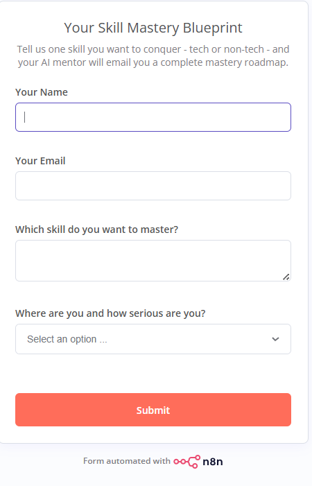
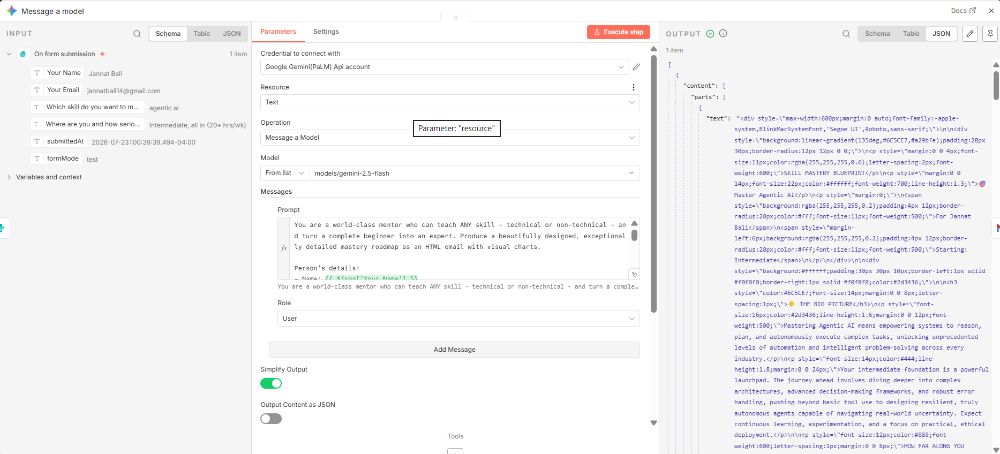
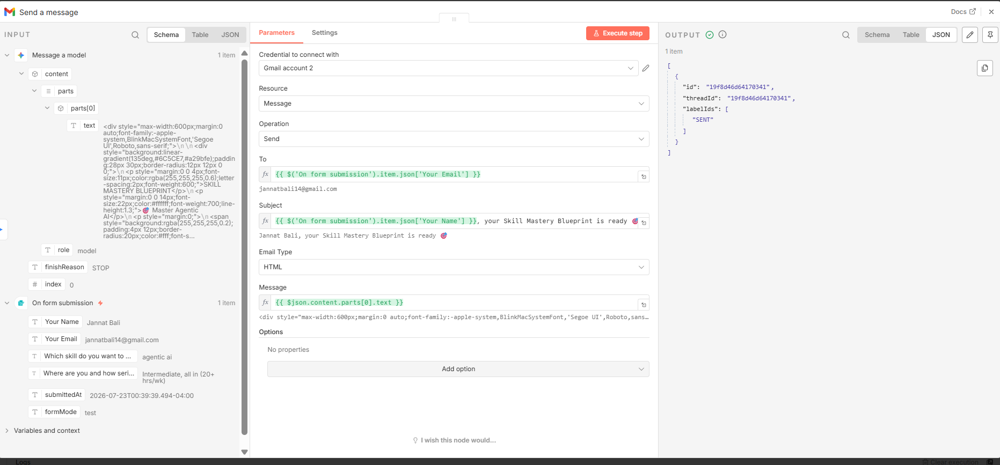
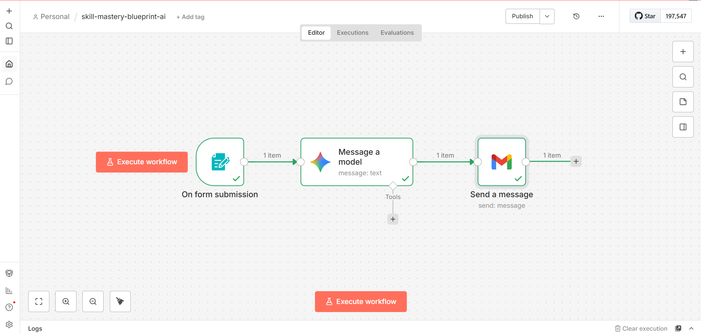

# 🚀 skill-mastery-blueprint-ai

An AI-powered automation built with **n8n**, **Google Gemini 2.5 Flash**, and **Gmail** that generates a personalized learning roadmap for any skill and delivers it directly to the user's inbox.

---

## 📌 Problem

People often don't know how to start learning a new skill or what roadmap to follow.

This workflow automatically creates a structured, personalized learning plan in seconds using AI.

---

## ✨ Features

- 📝 Collects user details through an n8n Form
- 🤖 Generates a personalized roadmap using Google Gemini AI
- 📧 Sends a beautifully formatted HTML email automatically
- 🎯 Works for both technical and non-technical skills
- ⚡ Fully automated with no manual intervention

---

# ⚙️ Workflow

```
User submits Form
        │
        ▼
Google Gemini generates a personalized roadmap
        │
        ▼
HTML email is created
        │
        ▼
Roadmap is sent automatically via Gmail
```

---

# 🛠 Tech Stack

- n8n
- Google Gemini 2.5 Flash
- Gmail API
- HTML Email
- Prompt Engineering

---

# 📥 Form Inputs

- Name
- Email Address
- Skill to Master
- Current Learning Level

---

# 📤 AI Generated Email Includes

- Personalized learning roadmap
- Skill overview
- Learning difficulty
- Market demand
- 30-Day learning plan
- Daily practice routine
- Best learning resources
- Recommended tools
- Career opportunities
- Income potential
- Milestones
- Common mistakes
- Skill stacking suggestions
- First steps to begin

---

# 📸 Screenshots

## Form



---

## Form Trigger


---

## Gemini Prompt



---

## Gmail Output



---

## Workflow



---


# 📂 Repository Structure

```
.
├── workflow (2).json
├── workflow.png
├── form.png
├── form trigger.png
├── Gemini.png
├── message.png
├── LICENSE
└── README.md
```

---

# 🚀 Future Improvements

- PDF roadmap export
- Progress tracking
- User dashboard
- Multiple AI model support
- Database integration
- Learning reminders
- Roadmap history

---

# 👨‍💻 Author

**Jannat Bali**

GitHub:
https://github.com/studentJannatBali

---

⭐ If you found this project interesting, consider giving it a Star!
